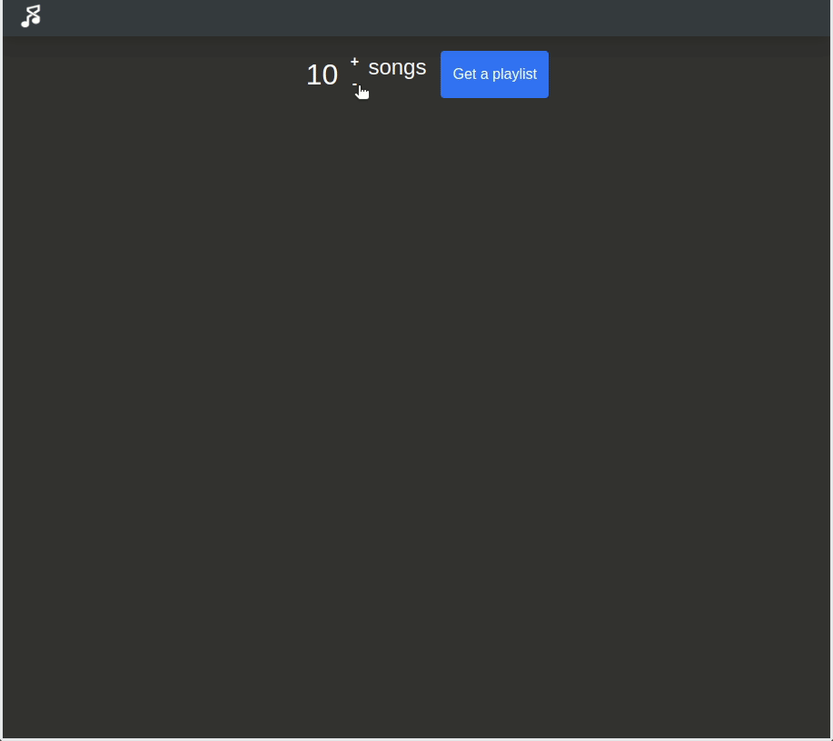

# random-playlist-generator

This app allows you to create and save randomly generated playlists. These playlists are save directly to your spotify account.



## Using the app locally

# `.env`
Environmental variables assigned in `.env` file at root level of React app
The client ID and Client Secret will have to be obtained throught the Spotify API
``` bash
CLIENT_ID="" # string
CLIENT_SECRET="" # string
# Redirect uri set in Spotify app
REDIRECT_URI="http://localhost:8080/callback"
PORT=8080 # int
```
# Running the App
App requires two terminal sessions, one at root and the other at `/client`.